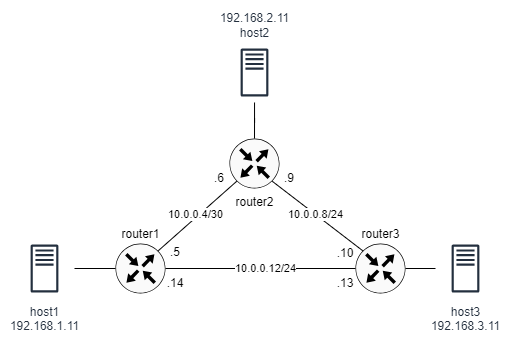
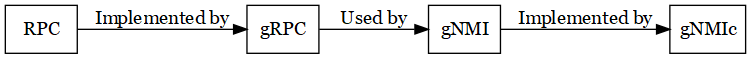

# Configuration Tutorial

This tutorial will guide you through the steps of configuring Nokia srlinux routers using the gNMIc and YANG models.

The containerlab toplogy file `lab1.clab.yaml` creates the ring topology shown in the figure below:



## Stating and Stopping the Lab

To start the lab:

```
$ sudo clab deploy [-t lab1.clab.yaml]
```

To stop the lab:

```
$ sudo clab destroy [-t lab1.clab.yaml]
```

## YANG Support

SR Linux is built to support YANG data models. Therefore, all management interfaces (CLI, gNMI, and JSON-RPC) are based on a common YANG models for configuration, state, and operational tasks. For example, the CLI command tree is derived the YANG models loaded into the system and a gNMI client can use the models to configure the system.

SR Linux supports the following YANG data models:

- Nokia vendor-specific data models
- OpenConfig vendor-neutral data models

You can use the OpenConfig data models together with the SR Linux data models to configure network elements, using a CLI console or SSH connection or management-interface RPCs (gNMI) for communications between the clients and routers. The SR Linux data models offer a more complete representation of the capabilities of the SR Linux network elements, because they include vendor-specific features and functions that the OpenConfig data models do not describe.


## Configuration Tasks

This tutorial will guide you through the steps of configuring the devices in the network so that hosts will be able to communicate with each other. The configuration tasks include:

- Configuring interfaces and subinterfaces (assign IPv4 addresses).
- Configuring OSPF routing protocol.

Note that the containerlab (using the topology file) assigns names to devices and IP addresses to the hosts. It also connects all devices to a management network 172.20.20.0/24 through the devices' management interface. All configuration tasks in the tutorial are performed through the management network.

Before proceeding with this lab, please review this [Introduction to Nokia SR Linux](https://martimy.github.io/clab_srl_dcn/srlinux.html).

### Configure an Interface using CLI

Interface configuration on the srlinux router involves three steps.

1. Create a subinterface: each router interface must have at least one subinterface. If VLANs are disabled on the interface, then only one subinterface is needed.
2. Configure an IPv4 address on the subinterface
3. Enable both the parent interface and the subinterface. Also enable ipv4 address (the interface can have multiple addresses, each can be enabled individually).

Sine most people are familiar with using CLI to configure routers, this is where we will start. The srlinux was built to support YANG model from the ground up, so the CLI is based on YANG.


Make sure the lab is deployed (see above) then use SSH to login to router1 (you can also use `docker exec -it router1 sr_cli`):

```
$ ssh admin@router1
```

The username/password, if required, are *admin/NokiaSrl1*.

Once logged in, you will be in the running mode:

```
Welcome to the srlinux CLI.
Type 'help' (and press <ENTER>) if you need any help using this.

--{ + running }--[  ]--
A:router1#
Current mode: + running
```

To make any configuration changes, you must enter the Candidate mode. Once inside the candidate mode (the bottom of the screen shows the current mode), you can update the configuration using the `set` command. Use the tab key to display a menu that shows all the next possible keywords then use the navigation keys to select the required keyword. At the end you need to type the address "192.168.1.1/24".

```
Welcome to the srlinux CLI.
Type 'help' (and press <ENTER>) if you need any help using this.

--{ running }--[  ]--
A:router1# enter candidate

--{ candidate shared default }--[  ]--
A:router1# set /interface ethernet-1/21 admin-state enable subinterface 0 admin-state enable ipv4 admin-state enable address 192.168.1.1/24
```

Type `diff` to view the configuration changes you made.

```
A:router1# diff
      interface ethernet-1/21 {
+         subinterface 0 {
+             admin-state enable
+             ipv4 {
+                 admin-state enable
+                 address 192.168.1.1/24 {
+                 }
+             }
+         }
      }
```

Repeat the command using the `flat` option:

```
A:router1# diff flat
insert / interface ethernet-1/21 subinterface 0
insert / interface ethernet-1/21 subinterface 0 admin-state enable
insert / interface ethernet-1/21 subinterface 0 ipv4
insert / interface ethernet-1/21 subinterface 0 ipv4 admin-state enable
insert / interface ethernet-1/21 subinterface 0 ipv4 address 192.168.1.1/24
```

The `set` command updates the configuration as follows:

- Creates a subinterface 0 for the parent interface `ethernet-1/21` and enables it (the parent interface is enabled by clab).
- Creates an IPv4 address and enables it as well.


These configuration changes are not committed yet, so they have no affect on the running configuration. To commit the changes, use `commit now`, which will apply the configuration and move you back to the running mode (if the configuration includes error, you will not be able to commit the changes).

```
A:router1# commit now
All changes have been committed. Leaving candidate mode.

--{ + running }--[  ]--
A:router1#
Current mode: + running
```

In the running mode, you can verify the status of the interface using `show` command:

```
A:router1# show interface ethernet-1/21.0
==============================================================================
  ethernet-1/21.0 is up
    Network-instances:
    Encapsulation   : null
    Type            : routed
    IPv4 addr    : 192.168.1.1/24 (static, None)
==============================================================================
```

That was a brief demonstration of using the CLI, but this lab will focus on using gNMIc and YANG to configure the router, so exit the router by pressing `CTRL-D`, or type `quit` and press `ENTER`.

```
A:router1# quit
Connection to router1 closed.
```

### Introducing gNMIc

gNMIc is a gNMI (gRPC Network Management Interface) CLI (Command Line Interface) client and collector. It provides full support for gNMI RPCs (Remote Procedure Calls) including Capabilities, Get, Set, and Subscribe. Please consult the [gNMIc documentation](https://gnmic.openconfig.net/) for details.



The gNMIc tool requires credentials and other information to be able to access routers. Instead of repeatedly supplying all of this information in the command line, we can use environment variables. So before using gNMIc, you will need to set the environment variables:

```
$ source env.sh
```

**Capabilities**

gNMIc 'capabilities' command retrieves the set of capabilities supported by the target system. These capabilities include:

- gNMI version
- available data models
- supported encodings
- gNMI extensions

This allows gNMIc to retrieve the set of models that the target supports, which can then be specified in subsequent commands.

Applying the next command will show a long list of capabilities supported by the router, including a list of supported encoding (the environment variables you set earlier specify the encoding to be JSON_IETF).

```
$ gnmic -a router1 capabilities
gNMI version: 0.10.0
supported models:
  - urn:srl_nokia/aaa:srl_nokia-aaa, Nokia, 2023-10-31
...
supported encodings:
  - JSON_IETF
  - PROTO
  - ASCII
...
```

You can search the output for specific capabilities, such as the support of interface, network instances, and OSPF configuration:

```
$ gnmic -a router1 capabilities | awk -F  ':' '/interface/ {print $3}'
srl_nokia-if-ip, Nokia, 2023-07-31
srl_nokia-if-mpls, Nokia, 2021-06-30
srl_nokia-interfaces, Nokia, 2023-10-31
...
```

```
$ gnmic -a router1 capabilities | awk -F  ':' '/network-instance/ {print $3}'
...
srl_nokia-network-instance, Nokia, 2023-10-31
...
```

```
$ gnmic -a router1 capabilities | awk -F  ':' '/ospf/ {print $3}'
srl_nokia-ospf, Nokia, 2023-07-31
srl_nokia-tools-ospf, Nokia, 2023-03-31
```  

We will use these capabilities to configure the routers.

**Using get Command**

You can use the gNMIc's `get` command to view in the interface configuration you just created on the router:

```
$ gnmic -a router1 get --path /interface[name=ethernet-1/21]/subinterface[index=0] -t config
[
  {
    "source": "router1",
    "timestamp": 1717336911489635846,
    "time": "2024-06-02T11:01:51.489635846-03:00",
    "updates": [
      {
        "Path": "srl_nokia-interfaces:interface[name=ethernet-1/21]/subinterface[index=0]",
        "values": {
          "srl_nokia-interfaces:interface/subinterface": {
            "admin-state": "enable",
            "ipv4": {
              "address": [
                {
                  "ip-prefix": "192.168.1.1/24"
                }
              ],
              "admin-state": "enable"
            }
          }
        }
      }
    ]
  }
]
```

The previous command includes the following flags:

- `-a`: Address of the target router (multiple targets can be included separated by commas).
- `--path` Specifies the path to the specific configuration data. Notice that the path includes the name of the interface and the index of the subinterface.
- `-t config`: Specifies that only configuration data is requested (this excludes statistics, for example).

The output shown above is in JSON format, which is the default. Use `flat` format to display the interface configuration in xpath-style paths:

```
$ gnmic -a router1 get --path /interface[name=ethernet-1/21]/subinterface[index=0] -t config --format flat
srl_nokia-interfaces:interface[name=ethernet-1/21]/subinterface[index=0]/admin-state: enable
srl_nokia-interfaces:interface[name=ethernet-1/21]/subinterface[index=0]/ipv4/address.0/ip-prefix: 192.168.1.1/24
srl_nokia-interfaces:interface[name=ethernet-1/21]/subinterface[index=0]/ipv4/admin-state: enable
```

**gNMIc and XPath**

gNMIc uses YANG [XPath](xpath.md) to specify the data being requested or updated. For instance, in the previous example, the gNMIc command `get` is used to get xpaths related to the interface configuration. The `flat` format displays the configuration in path style.

It is also possible, using the gNMIc `path` command, to generate and search through the XPath-style paths extracted from a YANG file. Once paths are extracted from a YANG model, it is possible to utilize CLI search tools like `awk`, `sed` and `alike` to find the paths satisfying specific matching rules.


**Exercises:**

- Use the `get` command again but remove the interface name and the subinterface index. Describe the output.
- Why there is no IP address configured for the `mgmt0.0` interface?
  - Investigate using `$ gnmic -a router1 get --path /interface[name=mgmt0]/subinterface -t config`
  - Repeat the `get` command using the option `-t state`


### Configure Interfaces using gNMIc

Now we will use the gNMIc tool to configure the interfaces on the other two routers. Note that any configuration update using the gNMIc will take effect immediately (i.e. no candidate configuration).

To change the configuration (add, update, or delete), we need to use the `set` command. The command can be applied with several flags, including:

- `--update-path`: Specifies the path in the YANG model to the configuration item to be updated.
- `--update-value`: Provides the new value for the specified configuration item, either as a value or as a JSON object.

Whenever routers have similar configuration, we can use one command for all routers by including the target routers' addresses in the `-a` flag. The following command creates a subinterface with index 0 (the index can be any number in the range 0 to 9999). The output indicates if the update is successful.

```
$ gnmic -a router2,router3 set \
--update-path /interface[name=ethernet-1/21]/subinterface[index=0] \
--update-value '{"index": 0}'
[router3] {
[router3]   "source": "router3",
[router3]   "timestamp": 1717337639373093999,
[router3]   "time": "2024-06-02T11:13:59.373093999-03:00",
[router3]   "results": [
[router3]     {
[router3]       "operation": "UPDATE",
[router3]       "path": "interface[name=ethernet-1/21]/subinterface[index=0]"
[router3]     }
[router3]   ]
[router3] }
[router2] {
[router2]   "source": "router2",
[router2]   "timestamp": 1717337639403358896,
[router2]   "time": "2024-06-02T11:13:59.403358896-03:00",
[router2]   "results": [
[router2]     {
[router2]       "operation": "UPDATE",
[router2]       "path": "interface[name=ethernet-1/21]/subinterface[index=0]"
[router2]     }
[router2]   ]
[router2] }
```

The IP address for each subinterface is different so we use separate command for each router:

```
$ gnmic -a router2 set \
--update-path /interface[name=ethernet-1/21]/subinterface[index=0]/ipv4 \
--update-value '{"address": [{"ip-prefix": "192.168.2.1/24"}]}'
<output omitted>
$ gnmic -a router3 set \
--update-path /interface[name=ethernet-1/21]/subinterface[index=0]/ipv4 \
--update-value '{"address": [{"ip-prefix": "192.168.3.1/24"}]}'
<output omitted>
```

Finally, we enable all subinterfaces and the IPv4 addresses:

```
$ gnmic -a router2,router3 set \
--update-path /interface[name=ethernet-1/21]/subinterface[index=0]/admin-state \
--update-value enable \
--update-path /interface[name=ethernet-1/21]/subinterface[index=0]/ipv4/admin-state \
--update-value enable
```

Verify the configuration success using the `get` command as above:

```
$ gnmic -a router2,router3 get --path /interface[name=ethernet-1/21] -t config --format flat
[router3] srl_nokia-interfaces:interface[name=ethernet-1/21]/admin-state: enable
[router3] srl_nokia-interfaces:interface[name=ethernet-1/21]/subinterface.0/admin-state: enable
[router3] srl_nokia-interfaces:interface[name=ethernet-1/21]/subinterface.0/index: 0
[router3] srl_nokia-interfaces:interface[name=ethernet-1/21]/subinterface.0/ipv4/address.0/ip-prefix: 192.168.3.1/24
[router3] srl_nokia-interfaces:interface[name=ethernet-1/21]/subinterface.0/ipv4/admin-state: enable
[router3]
[router2] srl_nokia-interfaces:interface[name=ethernet-1/21]/admin-state: enable
[router2] srl_nokia-interfaces:interface[name=ethernet-1/21]/subinterface.0/admin-state: enable
[router2] srl_nokia-interfaces:interface[name=ethernet-1/21]/subinterface.0/index: 0
[router2] srl_nokia-interfaces:interface[name=ethernet-1/21]/subinterface.0/ipv4/address.0/ip-prefix: 192.168.2.1/24
[router2] srl_nokia-interfaces:interface[name=ethernet-1/21]/subinterface.0/ipv4/admin-state: enable
[router2]
```

### Create a Network Instance

If you try to ping from a host to one of the routers, the ping will fail:

```
$ docker exec host1 ping 192.168.1.1
```

The reason is that the subinterfaces we just configured must be associated with a network-instance (aka VRF). Initially, the only network-instance configured on the router is the `mgmt`, in which all management interfaces belong.

The following command shows that the "mgmt" network-instance has one interface, "mgmt0.0", which is the interface that we are using to configure the routers.


```
$ gnmic -a router1 get --path /network-instance -t config
[
  {
    "source": "router1",
    "timestamp": 1716733501911687374,
    "time": "2024-05-26T11:25:01.911687374-03:00",
    "updates": [
      {
        "Path": "",
        "values": {
          "": {
            "srl_nokia-network-instance:network-instance": [
              {
                "admin-state": "enable",
                "description": "Management network instance",
                "interface": [
                  {
                    "name": "mgmt0.0"
                  }
                ],
                "name": "mgmt",
                "protocols": {
                  "srl_nokia-linux:linux": {
                    "export-neighbors": true,
                    "export-routes": true,
                    "import-routes": true
                  }
                },
                "type": "srl_nokia-network-instance:ip-vrf"
              }
            ]
          }
        }
      }
    ]
  }
]
```

We will need to create a network-instance named "default" (the "default" network-instance in srlinux has special features). The following sequence of updates create a network-instance named "default", enable it, then associate the previously configured interface.


```
$ gnmic -a router1 set \
--update-path /network-instance[name=default] \
--update-value '{"name": "default"}' \
--update-path /network-instance[name=default]/admin-state \
--update-value enable \
--update-path /network-instance[name=default] \
--update-value '{"interface": [{"name": "ethernet-1/21.0"}]}'
```


Now it is possible to ping the router from the host:

```
$ docker exec host1 ping 192.168.1.1
PING 192.168.1.1 (192.168.1.1) 56(84) bytes of data.
64 bytes from 192.168.1.1: icmp_seq=1 ttl=64 time=8.06 ms
64 bytes from 192.168.1.1: icmp_seq=2 ttl=64 time=6.38 ms
64 bytes from 192.168.1.1: icmp_seq=3 ttl=64 time=9.05 ms
...
```

Using `update-value` is useful for small configuration changes. As configuration updates gets more elaborate, we will need a more efficient approach. For that we can use a configuration file.

Create a file `instance_config.json` and include the following JSON object:

```
{
  "name": "default",
  "admin-state": "enable",
  "interface": [{"name": "ethernet-1/21.0"}]
}
```

or you can use YAML in file `instance_config.yaml`:

```
name: default
admin-state: enable
interface:
  - name: ethernet-1/21.0
```

Using either one of configuration files, we can update the configuring using gNMIc flag `--update-file`:

```
$ gnmic -a router2,router3 set \
--update-path /network-instance[name=default] \
--update-file config/instance_config.json
```

Let's verify ping

```
$ docker exec host2 ping 192.168.2.1
PING 192.168.2.1 (192.168.2.1) 56(84) bytes of data.
64 bytes from 192.168.2.1: icmp_seq=1 ttl=64 time=18.2 ms
64 bytes from 192.168.2.1: icmp_seq=2 ttl=64 time=1.59 ms
^C
$ docker exec host3 ping 192.168.3.1
PING 192.168.3.1 (192.168.3.1) 56(84) bytes of data.
64 bytes from 192.168.3.1: icmp_seq=1 ttl=64 time=11.4 ms
64 bytes from 192.168.3.1: icmp_seq=2 ttl=64 time=5.11 ms
^C
```

Use flat format to verify configuration:

```
$ gnmic -a router1,router2,router3 get --path /network-instance[name=default] -t
config --format flat
[router3] srl_nokia-network-instance:network-instance[name=default]/admin-state: enable
[router3] srl_nokia-network-instance:network-instance[name=default]/interface.0/name: ethernet-1/21.0
[router3]
[router1] srl_nokia-network-instance:network-instance[name=default]/admin-state: enable
[router1] srl_nokia-network-instance:network-instance[name=default]/interface.0/name: ethernet-1/21.0
[router1]
[router2] srl_nokia-network-instance:network-instance[name=default]/admin-state: enable
[router2] srl_nokia-network-instance:network-instance[name=default]/interface.0/name: ethernet-1/21.0
[router2]
```

### Saving Configuration


At this point, you may be wondering how to save the router configuration. You can log into the router and save the configuration using the CLI.

```
A:router1# save startup
```

However, containerlab provides a convenient way to save the configuration for all routers at once using the `save` command:

```
$ sudo clab save
INFO[0000] Parsing & checking topology file: lab1.clab.yaml
INFO[0004] saved SR Linux configuration from router3 node. Output:
/system:
    Saved current running configuration as initial (startup) configuration '/etc/opt/srlinux/config.json'

INFO[0004] saved SR Linux configuration from router1 node. Output:
/system:
    Saved current running configuration as initial (startup) configuration '/etc/opt/srlinux/config.json'

INFO[0004] saved SR Linux configuration from router2 node. Output:
/system:
    Saved current running configuration as initial (startup) configuration '/etc/opt/srlinux/config.json'
```

The output shows that the startup configuration is save in router's directory `/etc/opt/srlinux/config.json`. In your host machine, this file is saved under individual router's directory in the `clab-lab1` directory.

**CAUTION:** Exiting the lab using `destroy --clean-up` option, will remove the `clab-lab1`. DO NOT use this this option until after you complete the lab. Instead, you can stop the lab, if needed, using:

```
$ sudo clab destroy
```


### More Interface Configuration

Now we need to configure the remaining interfaces between each pair of routers. Since we now all the elements needed for the configuration, we can create a JSON (or YAML) file that perform all the steps needed.

Edit a file `interfaces_config.yaml` as follows:

```yaml
interface:
- admin-state: enable
  name: ethernet-1/11
  subinterface:
    - admin-state: enable
      description: To Router2
      index: 0
      ipv4:
        admin-state: enable
        address:
          ip-prefix: 10.0.0.5/30

- admin-state: enable
  name: ethernet-1/12
  subinterface:
    - admin-state: enable
      description: To Router3
      index: 0
      ipv4:
        admin-state: enable
        address:
          ip-prefix: 10.0.0.9/30
```

Notice that the file includes the configuration for two interfaces. To use this file, we have to use the flag `--update-path` with path '/' since interface is one of the top nodes in the YANG models (see [Using get Command] section).

```
$ gnmic -a router1 set --update-path / --update-file config/interfaces_config.yaml
```


To verify, use the following command, which will list all configured interfaces on the router1:

```
$ gnmic -a router1 get --path /interface -t config --format flat
```

### Using `request-file` Flag


The `--request-file` flag simplifies the configuration process further by combining multiple paths and operations (update, replace or delete) in one file. The configuration file that can be used for router2 looks like the following:

```yaml
updates:
  - path: /interface[name=ethernet-1/11]
    value:
      admin-state: enable
      description: router2 to router3
      subinterface:
        - index: 0
          admin-state: enable
          ipv4:
            admin-state: enable
            address:
              - ip-prefix: 10.0.0.9/30
  - path: /interface[name=ethernet-1/12]
    value:
      admin-state: enable
      description: router2 to router1
      subinterface:
        - index: 0
          admin-state: enable
          ipv4:
            admin-state: enable
            address:
              - ip-prefix: 10.0.0.6/30
  - path: /network-instance[name=default]
    value:
      interface:
        - name: ethernet-1/11.0
        - name: ethernet-1/12.0
```

The file includes these components:

- updates: This is a list that contains one or more update entries. Each entry specifies a path and the value to set at that path.
- path: This specifies the path to the configuration that is being updated. There are two paths.
- value: This section contains the configuration details for the specified path.

The file creates a subinterface for two interfaces connecting the routers then add the interfaces to the "default" network instance.

One of the features of the `--request-file` is the ability to add per-target template variables using a [Go Text template](https://developer.hashicorp.com/nomad/tutorials/templates/go-template-syntax).

In the previous file, we need to set the IP address for each interface and for each router, so we will need a file for each router. We can use templates to automate this process. Without going into the details of the Go Template syntax, the above file can be modified as follows:

```yaml
updates:
{{ $target := index .Vars .TargetName }}
{{- range $interface := index $target "interfaces" }}
  - path: "/interface[name={{ index $interface "name" }}]"
    value:
      admin-state: enable
      description: {{ index $interface "description" | default "" }}
      subinterface:
        - index: 0
          admin-state: enable
          ipv4:
            admin-state: enable
            address:
              - ip-prefix: {{ index $interface "ipv4-prefix" }}
  - path: "/network-instance[name=default]"
    value:
      interface:
        name: {{ index $interface "name" }}{{".0"}}
{{- end }}
```


The variables file will include the values needed for each router/interface:

```yaml
router1:
  interfaces:
    - name: ethernet-1/11
      description: "router1_to_router2"
      ipv4-prefix: "10.0.0.5/30"
    - name: ethernet-1/12
      description: "router1_to_router3"
      ipv4-prefix: "10.0.0.14/30"

router2:
  interfaces:
    - name: ethernet-1/11
      description: "router2_to_router3"
      ipv4-prefix: "10.0.0.9/30"
    - name: ethernet-1/12
      description: "router2_to_router1"
      ipv4-prefix: "10.0.0.6/30"

router3:
  interfaces:
    - name: ethernet-1/11
      description: "router3_to_router1"
      ipv4-prefix: "10.0.0.13/30"
    - name: ethernet-1/12
      description: "router3_to_router2"
      ipv4-prefix: "10.0.0.10/30"
```

Use the following `set` command for router1, router2, and router3.

```
$ gnmic -a router1,router2,router3 set --request-file config/interfaces_request.yaml
```

Once again, you can check the configuration of all interfaces using the `get` command:

```
$ gnmic -a router1,router2,router3 get --path /interface -t config --format flat
```


### Configure OSPF


We will use the last technique to configure OSPF. The file `ospf_config.yaml` includes basic OSPF configuration that we can use with the command `set --request-file` to configure each router. We will need to assign each router a unique router-id, so we can use Go Text template again. The router-id values are written in separate variables file (with `_vars` added to the name):

```
updates:
{{ $target := index .Vars .TargetName }}
- path: /network-instance[name=default]/protocols/ospf
  value:
    instance:
    - name: default
      router-id: {{ index $target "router-id" }}
      version: ospf-v2
      admin-state: enable
      area:
      - area-id: 0.0.0.0
        interface:
        - admin-state: enable
          interface-name: ethernet-1/11.0
        - admin-state: enable
          interface-name: ethernet-1/12.0
        - admin-state: enable
          interface-name: ethernet-1/21.0
```

The variables file `ospf_config_vars.yaml`:

```
router1:
  router-id: 1.1.1.1
router2:
  router-id: 2.2.2.2
router3:
  router-id: 3.3.3.3  
```

Finally, we apply the OSPF configuration:

```
$ gnmic -a router1,router2,router3 set --request-file ospf_config.yaml
```

This concludes all configuration required to establish end-to-end connectivity between all hosts in the network. You can verify this using ping:

```
$ docker exec host1 ping 192.168.2.11
```

Check the OSPF configuration:

```
$ gnmic -a router1 get --path /network-instance/protocols/ospf/ -t config --format flat
/srl_nokia-network-instance:network-instance.0/name: default
/srl_nokia-network-instance:network-instance.0/protocols/srl_nokia-ospf:ospf/instance.0/admin-state: enable
/srl_nokia-network-instance:network-instance.0/protocols/srl_nokia-ospf:ospf/instance.0/area.0/area-id: 0.0.0.0
/srl_nokia-network-instance:network-instance.0/protocols/srl_nokia-ospf:ospf/instance.0/area.0/interface.0/admin-state: enable
/srl_nokia-network-instance:network-instance.0/protocols/srl_nokia-ospf:ospf/instance.0/area.0/interface.0/interface-name: ethernet-1/11.0
/srl_nokia-network-instance:network-instance.0/protocols/srl_nokia-ospf:ospf/instance.0/area.0/interface.1/admin-state: enable
/srl_nokia-network-instance:network-instance.0/protocols/srl_nokia-ospf:ospf/instance.0/area.0/interface.1/interface-name: ethernet-1/12.0
/srl_nokia-network-instance:network-instance.0/protocols/srl_nokia-ospf:ospf/instance.0/area.0/interface.2/admin-state: enable
/srl_nokia-network-instance:network-instance.0/protocols/srl_nokia-ospf:ospf/instance.0/area.0/interface.2/interface-name: ethernet-1/21.0
/srl_nokia-network-instance:network-instance.0/protocols/srl_nokia-ospf:ospf/instance.0/name: default
/srl_nokia-network-instance:network-instance.0/protocols/srl_nokia-ospf:ospf/instance.0/router-id: 1.1.1.1
/srl_nokia-network-instance:network-instance.0/protocols/srl_nokia-ospf:ospf/instance.0/version: srl_nokia-ospf-types:ospf-v2
```

You can also get the routing table (although you will probably need to format it using other tools):

```
$ gnmic -a router1 get --path /network-instance[name=default]/route-table
```

This concludes the tutorial.

## Links

- [Nokia SR Linux 23.10 Configuration Basics](https://documentation.nokia.com/srlinux/23-10/title/basics.html)
